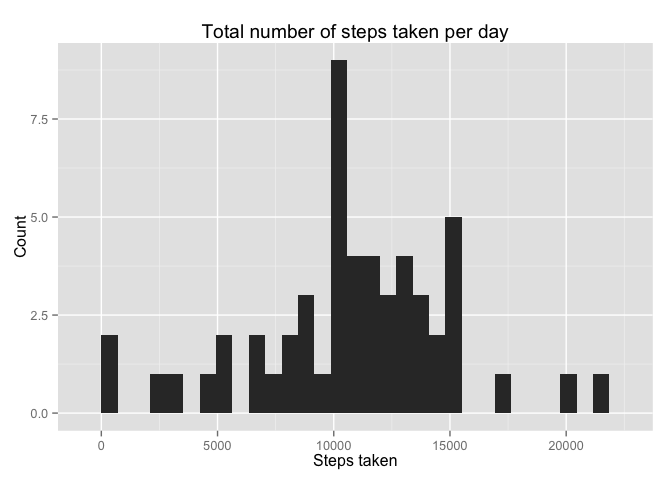
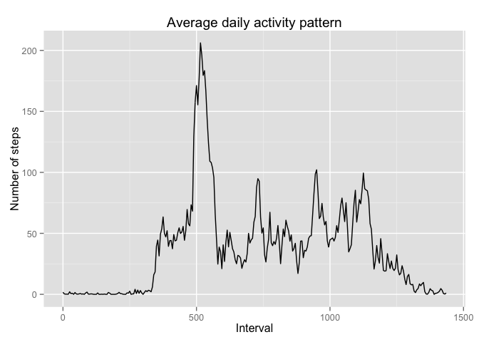

# Reproducible Research: Peer Assessment 1

In this report we analyze data from a personal activity monitoring device as described [here](README.md).

## Loading and preprocessing the data

We will use the `dplyr` pckage to manipulate the data, so load it first.


```r
library(dplyr)
```

```
## 
## Attaching package: 'dplyr'
## 
## The following objects are masked from 'package:stats':
## 
##     filter, lag
## 
## The following objects are masked from 'package:base':
## 
##     intersect, setdiff, setequal, union
```

We load the data directly from the zip file, and turn it into a `tbl`.


```r
activity <- tbl_df(read.csv(file = unz(description = "activity.zip", filename = "activity.csv")))
activity
```

```
## Source: local data frame [17,568 x 3]
## 
##    steps       date interval
##    (int)     (fctr)    (int)
## 1     NA 2012-10-01        0
## 2     NA 2012-10-01        5
## 3     NA 2012-10-01       10
## 4     NA 2012-10-01       15
## 5     NA 2012-10-01       20
## 6     NA 2012-10-01       25
## 7     NA 2012-10-01       30
## 8     NA 2012-10-01       35
## 9     NA 2012-10-01       40
## 10    NA 2012-10-01       45
## ..   ...        ...      ...
```

## What is mean total number of steps taken per day?

We calculate the total number of steps taken per day, ignoring missing values.


```r
by_date <- activity %>% filter(!is.na(steps)) %>% group_by(date) %>% summarize(steps = sum(steps))
by_date
```

```
## Source: local data frame [53 x 2]
## 
##          date steps
##        (fctr) (int)
## 1  2012-10-02   126
## 2  2012-10-03 11352
## 3  2012-10-04 12116
## 4  2012-10-05 13294
## 5  2012-10-06 15420
## 6  2012-10-07 11015
## 7  2012-10-09 12811
## 8  2012-10-10  9900
## 9  2012-10-11 10304
## 10 2012-10-12 17382
## ..        ...   ...
```

We make a histogram of the total number of steps taken each day.


```r
library(ggplot2)
ggplot(data = by_date, mapping = aes(x = steps)) +
  geom_histogram() +
  xlab("Steps taken") +
  ylab("Count") +
  ggtitle("Total number of steps taken per day")
```

```
## stat_bin: binwidth defaulted to range/30. Use 'binwidth = x' to adjust this.
```

 

We calculate the mean and median of the total number of steps taken each day.


```r
summ <- by_date %>% summarize(mean = mean(steps), median = median(steps))
summ
```

```
## Source: local data frame [1 x 2]
## 
##       mean median
##      (dbl)  (int)
## 1 10766.19  10765
```

So the mean number of steps taken per day is 10766.19 and the median is 10765.

## What is the average daily activity pattern?

We make a time series plot of the average number of steps taken for each time interval. First we need to find the mean number of steps for each interval, again ignoring missing data. Note that the `mutate` call derives from the interval format a simple number of minutes after midnight.


```r
by_interval <-
  activity %>%
  filter(!is.na(steps)) %>%
  group_by(interval) %>%
  summarize(steps = mean(steps)) %>%
  mutate(minutes_after_midnight = 60 * (interval %/% 100) + interval %% 100)
```

Then we make the plot.


```r
ggplot(data = by_interval, mapping = aes(x = minutes_after_midnight, y = steps)) +
  geom_line() +
  xlab("Interval (minutes after midnight)") +
  ylab("Average steps taken") +
  ggtitle("Average daily activity pattern")
```

 

Which of these intervals contains the maximum number of steps?


```r
by_interval$interval[which.max(by_interval$steps)]
```

```
## [1] 835
```

This corresponds with the interval at 8:35 am.

## Imputing missing values

We determine how many missing values are in the dataset.


```r
sum(is.na(activity$steps))
```

```
## [1] 2304
```

Since we expect the daily activity pattern to be reasonable regular, it makes sense to impute missing values based on the mean for the same interval on other days. We fill in the missing data based on this strategy.


```r
imputed <- merge(x = activity, y = by_interval, by = "interval") %>%
  mutate(steps = ifelse(is.na(steps.x), steps.y, steps.x))
```

Note that in the resulting dataset, `steps.x` is the original observed value (which might be `NA`); `steps.y` is the mean value that will be used for imputation if necessary; and `steps` is the final (possibly imputed) value.

## Are there differences in activity patterns between weekdays and weekends?
